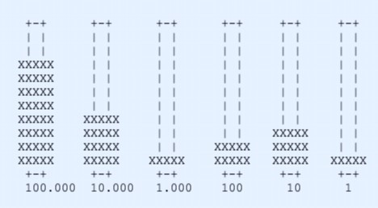

<!-- PROJECT LOGO -->
 

    
  </a>

  <h1 align="center">Bootcamp Awakelab</h1>
  <h2 align="center">Full Stack Python</h2>
  <h3 align="center">Evaluación 2</h3>
  <h4 align="center">Confección de un ábaco digital</h4>

 

**Daniela Corvalan - Joao Guzmán - Pedro Cid**

## Enunciado

Haga un programa que muestre una cantidad ingresada por el usuario en
forma de abaco en pantalla:
En el ejemplo de abajo un usuario ingresó la cantidad 841.231, y se
debería desplegar la siguiente imagen en pantalla

 

## Implementación

### Paso 1:

* Maqueta del programa:
    * Definición de funciones a implementar según el enunciado del problema:
    * ` def solo_digitos() `  -> Función que valida la entrada del usuario aceptando
    solo digitos (6) y no caracteres.
    Debe retornar el numero o string que ingresó el usuario.
    * ` def descompone_numero() `  -> Función que toma el numero ingresado por el usuario y lo 
    descompone en las unidades que necesita el abaco. 
    unidad | decena | centena | unidad de 1.000 | unidad de 10.000 | unidad de 100.000
     Debe retornar todas estas variables.
    * ` def actualiza(numero) `  -> Función que muestra en pantalla el dibujo del abaco segun el numero ingresado.
    * ` def convertir_numero(numero) `  -> Función que aplica el punto separador de miles para mostrar la cifra con claridad.  
    *** debe retornar el resultado de la conversión.
    * ` def guardar_numero( ) `  -> Funcion que guarda el numero con punto en la lista que crea la función crea_historial.
    * ` def crea_tablero( ) `  -> Función que crea el tablero del ábaco mediante un diccionario.
    * ` def muestra_tablero( ) `  -> Función que imprime en pantalla el tablero del ábaco
    * ` def cambia_digito( ) `  ->  Función que controla el llenado del ábaco.
    * ` def crea_historial( ) `  ->  Función que crea una lista vacía.
    * ` def muestra_historial( ) `  ->  Función que imprime por pantalla el historial de números que se consultaron.
    * ` def cambia_digito( ) `  ->  Función 

### Paso 2:
* Creación de repositorio Github donde se trabaja con ramas por tareas asignadas según las funciones a desarrollar. Teniendo como base una rama Desarrollo donde convergen los aportes de los colaboradores.

### Paso 3:
* Aplicar merge con las diferentes ramas y empezar a realizar pruebas de funcionamiento.